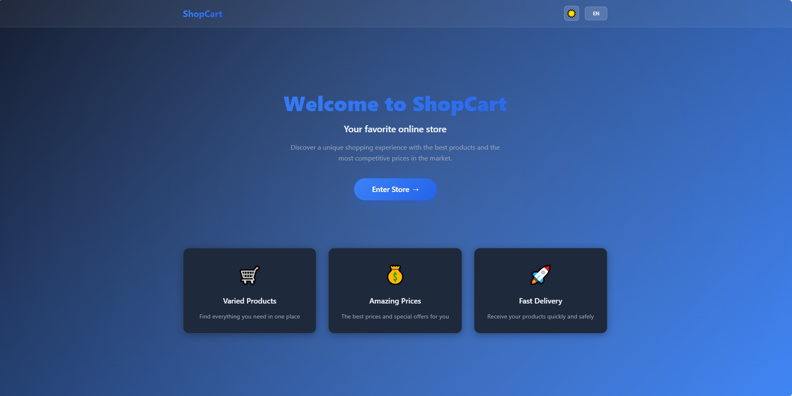
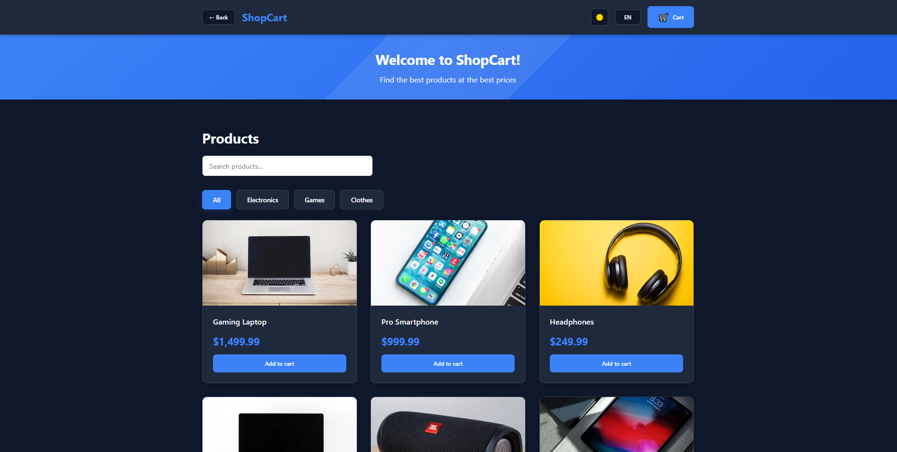
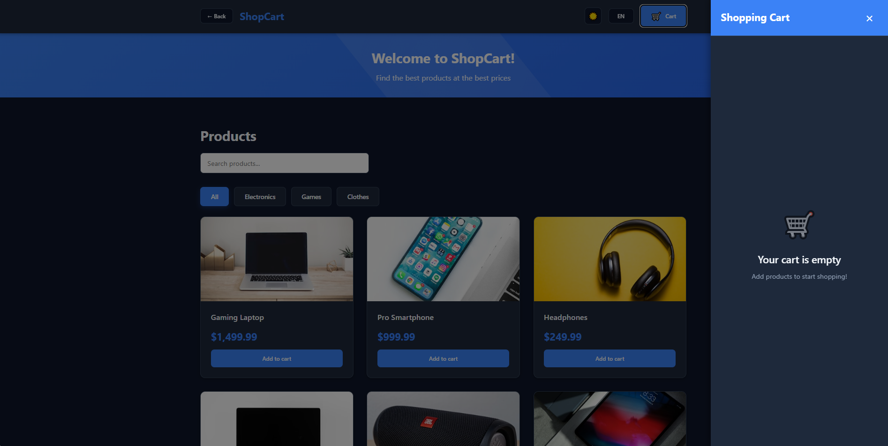
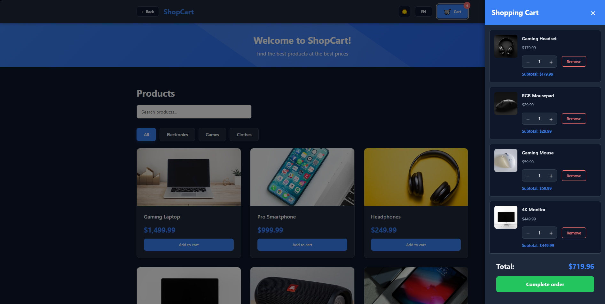
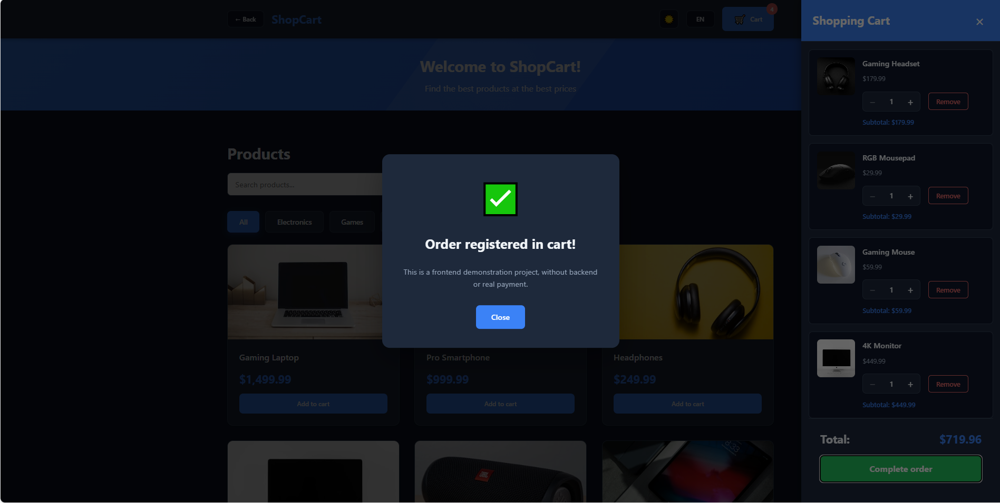
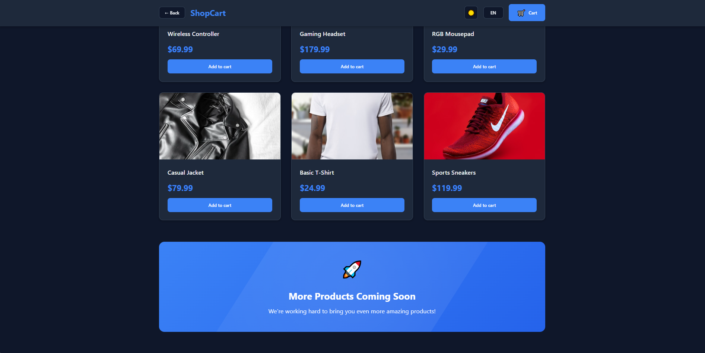

# ShopCart – Modern Mini E-commerce (Front-End Junior Portfolio)

🔗 **Repository:** *(you are already here)*  
🌐 **Live Demo (Vercel):** <a href="shopcart-bice.vercel.app" target="_blank">shopcart-bice.vercel.app</a>

## 📸 Project Preview

<p align="center">
  
  
  
</p>

<p align="center">
  
  
  
</p>

---

## 🚀 Summary for Recruiters

**ShopCart** is a clean, modern, and **fully responsive mini e-commerce UI** I **designed and built from scratch** using **React, TypeScript, and Vite** to demonstrate strong front-end fundamentals, real business logic, state architecture, persistence, and high attention to user experience.  
The entire project was **shipped to production using Vercel**, reflecting my ability to deliver portfolio-grade applications that are structured, scalable, and ready for contribution.

---

## ⚡ Quick Highlights

- ⚡ Fully responsive **Product Page + Cart Sidebar**
- 🛒 Smart cart logic with **item merging (no duplicates)**
- 💾 **localStorage persistence** (cart + language preferences)
- 🌎 Internationalization (**pt-BR, English, Spanish**)
- 🔍 Real-time **product search** with translated UI feedback
- ♻️ **Context API architecture** + reusable components
- 🧠 Business rules enforced (**min qty 1, auto totals update**)
- ⚠️ UI includes **loading & error states** with smooth UX
- 🚀 **Deployed on Vercel** (production preview ready)
- 🧩 **Type-safe development** with clean folder structure

---

## 🧩 Features

- Multi-language selector (**PT, EN, ES**)
- Product listing with **search and filters**
- **Add to cart**
- **Cart sidebar (drawer UI)**
- **localStorage persistence**
- Fully responsive (**mobile, tablet, desktop**)
- **Loading & error handling**
- **Accessibility** using `aria-label`
- **Auto-updated totals and subtotals**

---

## 📋 Requirements Covered

### 🏠 Product Page (Home)

- [x] Language selector (**PT, EN, ES**)
- [x] Product list (**image, name, price**)
- [x] “Add to Cart” button
- [x] Search field filtering by product name
- [x] Fully responsive UI

### 🛒 Cart Sidebar

- [x] Shows items (**image, name, price, quantity**)
- [x] Subtotal per item
- [x] Global total
- [x] Remove item button
- [x] `+ / −` quantity controls
- [x] Empty state UI when cart is empty

### 💾 Persistence

- [x] Cart stored in `localStorage`
- [x] Selected language stored in `localStorage`

### 🧠 Business Rules

- [x] No duplicate cart items (**increments quantity instead**)
- [x] Minimum quantity: **1**
- [x] Full item removal supported
- [x] Totals auto-updated dynamically
- [x] Empty state UX handled professionally

---

## 🛠️ Tech Stack

- **React 18** – UI Library
- **TypeScript** – Type safety & static typing
- **Vite** – Dev server & bundler
- **Context API** – State architecture
- **CSS Modules / Utility styling** – Scoped & reusable styles
- **Vercel** – Deployment & hosting

---

## 📦 Installation

```bash
# Install dependencies
npm install

# Start dev server
npm run dev

# Build for production
npm run build

# Preview production build
npm run preview
```

---

## 🗂 Project Structure

```
shopcart/
├── src/
│   ├── components/      # UI Components
│   ├── contexts/        # State (Cart + Language)
│   ├── i18n/locales/    # Translations (PT, EN, ES)
│   ├── data/            # Mock product data
│   ├── types/           # TypeScript interfaces
│   ├── App.tsx
│   └── main.tsx
├── package.json
├── vite.config.ts       # Aliases configured (@/ → src/)
└── tsconfig.json
```

---

## 🎯 Next Steps *(Optional Enhancements)*

- [ ] Real API integration
- [ ] User authentication
- [ ] Checkout & payment flow
- [ ] Order history
- [ ] Product reviews & ratings

---

## 💼 Why this project matters?

This project proves that I can:

✔ design responsive UIs that look **modern and professional**  
✔ implement **real front-end logic**, not just static pages  
✔ structure projects using **scalable and clean architecture**  
✔ ship **production-ready apps using Vercel**  
✔ write **clean, modern, and type-safe front-end code**

---

🚀 **Built with passion, focus, and real hiring intent for a Front-End Junior role.**  
I created, structured, developed, deployed, and validated every part of this project to show I’m ready to contribute immediately and grow within a professional team.

---

Developed with ❤️ using **React + TypeScript + Vite**
